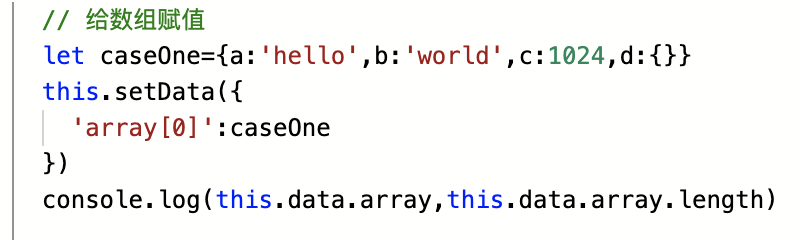
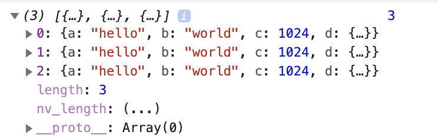
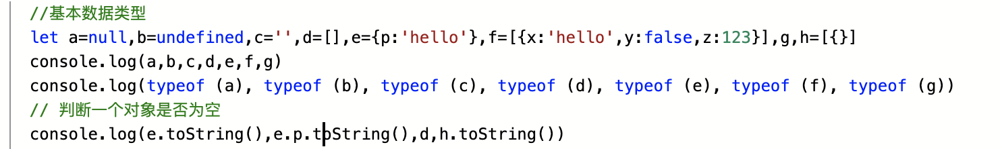

### 小程序 笔记
> 创建小程序项目
###### git init 
###### 添加.gitignore文件
切记:在第一次push代码前添加.gitignore文件,不然后续添加起来比较麻烦(后续也是可行的,但是会对commit记录有影响)
#### npm 安装

###### ===============
###### 第一步:npm init (成功后会生成package.json文件描述本项目的配置情况)
###### 第二步:npm install (微信小程序中安装npm包命令:npm install **** -S --production)
###### 安装成功后,会生成node_modules文件夹
###### 第三步:details->local settings->use npm modules
###### 第四步:工具->构建npm
#### ERROR:若出现npm package not found,考虑以下几个原因:
##### 1.此处并没有强制要求 node_modules 必须在小程序根目录下（即 project.config.js 中的 miniprogramRoot 字段），也可以存在于小程序根目录下的各个子目录中。但是不允许 node_modules 在小程序根目录外。
##### 2. 是否执行了npm init
##### 3. 是否勾选了设置中的使用使用npm模块
###### 至此 npm包安装成功,后续就可以使用

> 关于数组赋值
######  
###### 在使用setData({})进行赋值时,官方的样例是:
```
this.setData({
  'array[0].text':'change data'
})
```
###### 在利用setData({})进行赋值时,只能赋值一个静态值,于是上图的赋值可以改为下图:
######  
###### 向数组中添加元素时,由于push方法是将新数组作为一个元素加入在数组中,而concat将新数组每个元素分别加入到数组中,于是可以通过concat解决数组的添加 
```
    // 给数组赋值
    let caseOne = [
    { a: 'hello', b: 'world', c: 1024, d: {} }, 
    { a: 'hello', b: 'world', c: 1024, d: {} }, 
    { a: 'hello', b: 'world', c: 1024, d: {} }
    ]
    this.setData({
      array:this.data.array.concat(caseOne)
    })
    console.log(this.data.array,this.data.array.length)
```
###### 或者:
```
    // 给数组赋值
    let caseOne = [
    { a: 'hello', b: 'world', c: 1024, d: {} }, 
    { a: 'hello', b: 'world', c: 1024, d: {} }, 
    { a: 'hello', b: 'world', c: 1024, d: {} }
    ]
    caseOne.map(item=>{
      this.data.array.push(item)
    })   
    this.setData({
      array:this.data.array
    })
    console.log(this.data.array,this.data.array.length)
```
###### 只要最后赋给setData({})时,是一个静态值就ok~~
###### 


> watch监听器,监听父组件传递的值的变化
###### 若多个页面需要用到watch监听,则在app.js中写入监听器
```
onLaunch: function () {},
// 设置监听器
watch: function (ctx, obj) {
  Object.keys(obj).forEach(key => {
    this.observer(ctx.data, key, ctx.data[key], function (value) {
      obj[key].call(ctx, value)
    })
  })
},
// 监听属性，并执行监听函数
observer: function (data, key, val, fn) {
  Object.defineProperty(data, key, {
    configurable: true,
    enumerable: true,
    get: function () {
      return val
    },
    set: function (newVal) {
      if (newVal === val) return
      fn && fn(newVal)
      val = newVal
    },
  })
}
```
###### 在子组件中使用时,写入:
```
const app = getApp()
Page({
  data: {
    test: 0
  },
  onLoad: function () {
    // 调用监听器，监听数据变化
    app.watch(this, {
      test: function (newVal) {
        console.log(newVal)
      }
    })
  }
```
> 关于对象为空的判断
###### 1.使用JSON.stringify方法,将javascript的值转换成json字符串
```
 console.log(JSON.stringify(e)==='{}')
```
ps:toString()方法也是将数据转化为字符串,这里使用toString不能判断,对于空对象,toString()返回的是它的类型表示符"[object Object]"
###### 
###### 2.ES6的新方法 Object.keys()方法(该方法会返回一个由一个给定对象的自身可枚举属性组成的数组)
```
console.log(Object.keys(j).length===0)
```
>微信小程序中父子组件之间传值问题
###### 1.父组件向子组件传值
```
<my-component name="{{name}}" age="{{age}}"></my-component>
```
###### 上例中,父组件在引用子组件时,向其传入name和age值,在子组件中properties里接收该值,通过this.properties.name获取  
在实际项目开发时,可同时搭配watch值,监听该传递值的变化,同时,传递的值发生变化时,子组件会重新渲染,实现数据的绑定
###### 2.子组件向父组件传值
```
parent wxml中
<my-component name="{{name}}" age="{{age}}" bind:bindchangeName="changeName"></my-component>
parent js中
changeName(event) {
  console.log(event.detail)

  // { name: '李四' }
}
```
###### 上例中,在父组件wxml和js中分别添加上述代码,js中的`event`即为传递给父组件的数据
> wx中hidden和wx:if的选择和区别
###### 在进行条件选择渲染时,`使用hidden,在初始渲染时,各模块和组件均会渲染,初始渲染较慢较重,但是在切换时,各组件模块不会销毁  
和重新渲染`;`在使用wx:if时,初始时为局部渲染,减少了初始渲染的消耗,在初始渲染时,速度快且较轻便,但是每次条件更变切换时,组件都会销毁和重新渲染,故条件切换时,渲染速度较慢`
###### 所以在使用时,根据需求改变使用,若较频繁切换条件选择,则使用hidden若条件切换情况较少,则可使用wx:if
###### ps:hidden只对块级元素有用
> 字符串为空格或者空的判断
###### 1.match方法,match(RegExp)参数必须为要匹配字符串的正则表达式对象,若该参数不是正则表达式对象,则先将其传递给RegExp
构造函数,将其转化为正则表达式的对象:
```
var re = new RegExp("ab+c");  // RegExp 构造函数创建了一个正则表达式对象，用于将文本与一个模式匹配,返回该文本的正则表达式模式
```
```
var test = "   \n   ";
//var test = "      ";
if(test.match(/^\s+$/)){
    console.log("all space or \\n")  // 空格 or 换行
}
if(test.match(/^[ ]+$/)){
    console.log("all space")  // 全部是空格
}
if(test.match(/^[ ]*$/)){
    console.log("all space or empty") //空格或者是什么都没有
}
if(test.match(/^\s*$/)){
    console.log("all space or \\n or empty") //换行或者什么都没有
}
```
> 在实际项目开发中,学会各种css选择器助于提高开发效率和优化代码,减少不必要的类名和id名定义,提高代码可读性
###### 常用基础选择器有:元素选择器、类选择器、id选择器、选择器分组、后代选择器
###### 还有属性选择器([title/*])、子元素选择器(>)、相邻兄弟选择器(有同一个父元素,+)、伪类、伪元素
###### 1.伪类:  
###### :hover、:link、:visited、:active、<strong>:first-child</strong>、:lang
###### 讲解分析:first-child,经常有人错误地认为p:first-child之类地选择器会选择p元素地第一个子元素,了解如下:
```
p:first-child {font-weight: bold;}
li:first-child {text-transform:uppercase;}
#### 第一个规则将作为某元素第一个子元素的所有 p 元素设置为粗体。第二个规则将作为某个元素（在 HTML 中，这肯定是 ol 或 ul 元素）第一个子元素的所有 li 元素变成大写。
```
某个元素(相对的,相对于该选择器所处的位置)的第一个子元素,若`p:first-child {font-weight: bold;}`直接写在css文件的最外,则在为body中的第一个子元素为p的元素
###### 伪元素:常用:before、:after,聊天气泡即可用该伪元素实现,还有:first-letter(文本的第一个字母)、:first-line(文本的第一行)
> 微信小程序父子传值问题
###### 在实际项目开发中,遇到一个问题:在父组件中new了一个signal实例,该对象extends events,将其传递给子组件时,子组件得到的signal对象不完整,通过signal类构造器初始化的属性存在且正确,但是子组件中拿到的signal实例的_proto_直接为Object,而父组件new出来的signal实例的_proto_为events实例,表明子组件获取到的signal对象并没有继承到events,且在signal类中new的其他实例及其继承的类及方法也不存在
###### 推测:在new一个实例时,编译器会直接加载执行new实例时所遇到的文件,但是将其传递给子组件时,只传递最外面的一层,并没有深度传递整个实例
###### 解决办法:将new signal实例拉出来单独放在一个文件夹中,并将该实例暴露出来,在父组件和子组件中分别import使用

> wx小程序的缓存setStorageSync和getStorageSync
###### 默认情况下 微信小程序的缓存时永久的,除非用户主动清空微信小程序的缓存数据,但是在实际项目中,永久保存数据是不切实际的,故可以自动写一个缓存时间的设置,考虑是:若在登录时需要校验storage数据,则可存储一个未来时间的时间戳(当时时间数+据存储保留的时间)在storage中,每次登录时,取出storage中的时间戳和当前时间的时间戳进行比较,若当前时间大于storage中存储的时间,则清空storage中的存储数据,否则可以直接使用storage中存储的数据
```
Date.parse(new Date()) 
### 获取当前时间的时间戳

#### 以下用于小程序中storage缓存保留时间的实例
var timestamp = Date.parse(new Date()); // 当前时间的时间超
var expiration = timestamp + 60*1000*30; //缓存30分钟
var data_expiration = wx.getStorageSync(“data_expiration”);
if (data_expiration) {
if (timestamp > data_expiration) { 若当前时间的时间戳超过了storage中缓存保留的时间
wx.clearStorageSync()             则清空storage中缓存的数据
wx.setStorageSync(“data_expiration”, expiration)  // 重新设置新的保留截止时间的时间戳
}
} else {
// wx.setStorageSync(“data_expiration”, expiration)
}
```
> 界面交互时,使用wx提供的api,例如wx.showModel、wx.showToast等
> 在实际项目开发时,需要设置滚动条高度,首先在子组件的data中声明变量`scrollTop=0`,然后在ready()中`this.setData({scrollTop:500})`,但是实际wxml并没有任何改变,仍为0,或者为500,但是实际滚动条依然为0,检查了好多次,不知道是什么原因造成的.后来我又在`setTimeout({this.setData({scrollTop:500}},1000)`中设置滚动条高度,至此,wxml中滚动条显示正常了,所以在设置滚动条高度时,第一次的赋值不奏效时,可以延迟几秒再重新赋值第二次


